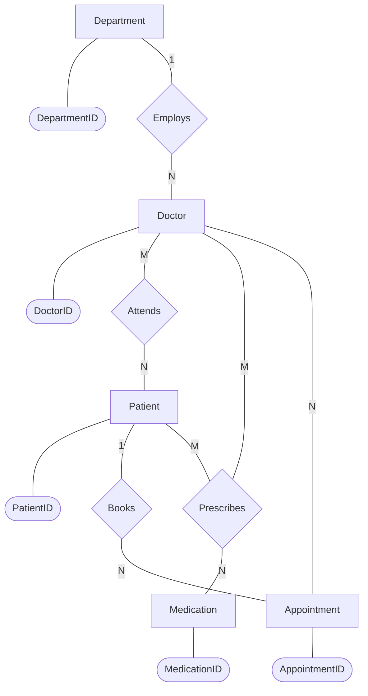

# Phase 1: Conceptual Design (Task 1)

## Part A: Analysis

In the City Care General Hospital system, the core entities required to model the clinical operations include **Departments** (Primary Key: `DepartmentID`), **Doctors** (Primary Key: `DoctorID`), **Patients** (Primary Key: `PatientID`), **Medications** (Primary Key: `MedicationID`), and **Appointments** (Primary Key: `AppointmentID`). The relationship between a Department and Doctors is **One-to-Many (1:N)** because a single department (e.g., Cardiology) employs multiple doctors, but each doctor is typically assigned to only one primary department. This structure ensures clear organizational hierarchy and resource allocation within the hospital.

The relationship between Doctors and Patients is **Many-to-Many (M:N)** because a single doctor can treat multiple patients over time, and a single patient can be seen by multiple different doctors (e.g., a general physician and a specialist). This relationship is often resolved through the "Appointments" entity, which acts as a bridge. Regarding participation constraints, a patient does not necessarily need an appointment to exist in the system (partial participation); they may be registered for emergency care, or simply have their historical records stored without any active appointments. Conversely, an appointment cannot exist without being linked to a valid patient and doctor (total participation).

## Part B: ER Diagram (Chen's Notation)

*Note: Since I am an AI, I cannot directly log into the Togetha app to draw the diagram for you. However, I have provided the logical structure below using Mermaid.js, mapped out in a style that represents Chen's notation (Rectangles for Entities, Diamonds for Relationships, and Ovals for Attributes). You can easily recreate this in the Togetha app to claim your 30 bonus points!*

